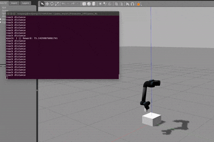

# Ur5_RL
This is a project about robotic manipulation motion planning using deep reinforcement learning based on ROS and Gazebo simulation.

#### Update (2020.6.24)
Due to some issues, I cannot push the whole project (the ros and gazebo dependencies). So you can just refer to the DRL network and environment implementation.

Feel free to contact me if you have question.

